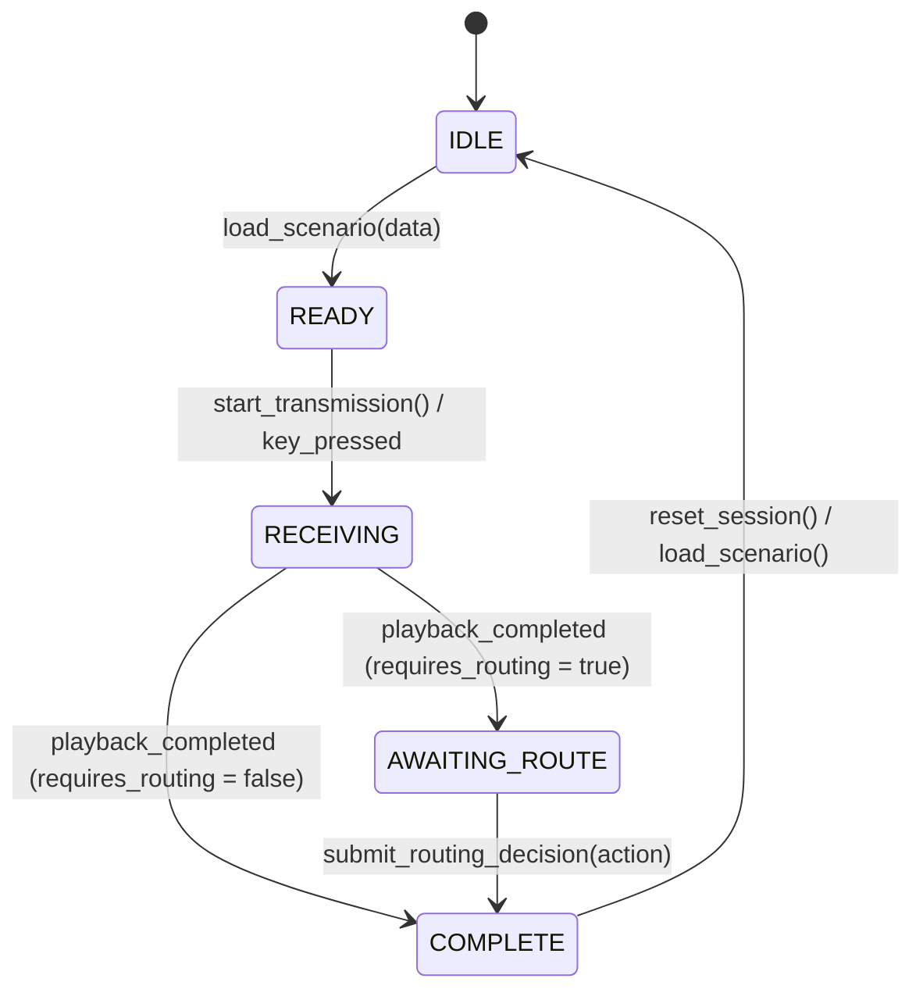

# M1 Telegraph Session State Machine Contract
**Project:** DEAD WIRE  
**Phase:** Milestone 1 — Gate 12 (Telegraph Session State Machine)  
**Author:** Senior Technical Researcher  
**Status:** IMPLEMENTED & VALIDATED  

---

## 1. Executive Summary & Purpose

The `TelegraphSessionController` is the scene-local orchestration manager for Milestone 1 telegraph gameplay. It manages scenario lifecycle, triggers pure Morse compilation, controls runtime playback, routes written transcripts to the desk paper, and records consequences into `WorldState` without reloading.

---

## 2. State Machine Lifecycle

---

## 3. Strict Source-of-Truth Routing

| Layer | Source Property | Destination Component | Behavioral Rule |
| :--- | :--- | :--- | :--- |
| **TRUE SIGNAL** | `transmission_data.true_message` | `AmericanMorseEncoder` $\rightarrow$ `SounderController` | Sounder plays objective historical Morse clicks |
| **ELIAS PERCEPTION** | `transmission_data.elias_perception` | Debug Telemetry / Cognitive Layer | Elias's subjective perception (not displayed on paper) |
| **WRITTEN TRANSCRIPT** | `transmission_data.written_transcript` | `TranscriptPaper` | Physical paper pad displays whatever Elias wrote |

The controller never reconciles, corrects, or evaluates discrepancies between layers.

---

## 4. Consequences Without Reload Contract

When a routing decision is submitted via `submit_routing_decision(action)`:
- If `action == expected_routing_action`: `WorldState.record_fact(correct_world_fact, true)`
- If `action != expected_routing_action`: `WorldState.record_fact(incorrect_world_fact, true)`
- The session transitions directly to `COMPLETE` without triggering game over, reload, or UI penalty screens.
